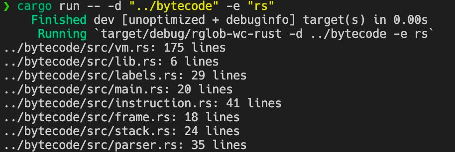

# RLC (Recursive Line Counter)

## How to use
___
<br>

**RLC** recursively searches for files with chosen extension in the start directory and prints paths to files with lines count. Project uses *argparse* crate, so usage is pretty simple:

```rust
cargo run -- --dir "rustlings" --ext "rs"
```

or

```rust
cargo run -- -d "rustlings" -e "rs"
```

___

<br>

## Example output
___

___
